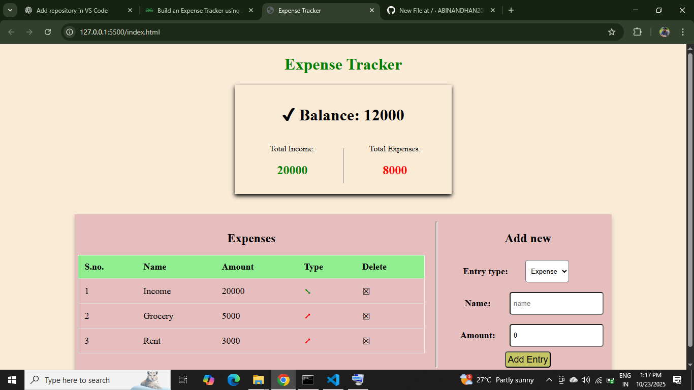

 Expense Tracker

A simple and user-friendly **Expense Tracker** web application built using **HTML, CSS, and JavaScript**. This project helps users to **add, track, and manage daily expenses** efficiently.

---

 **Features**
- Add new expenses with **amount and description**  
- Display all expenses in a table  
- **Delete expenses** easily  
- Responsive and clean design  
- Works entirely on the client-side (no backend required)  

---
 Screenshot


---
 **Tech Stack**
- HTML  
- CSS  
- JavaScript  

---

**Usage**
1. Clone the repository:
```bash
git clone https://github.com/ABINANDHAN2002/ExpenseTracker-.git
